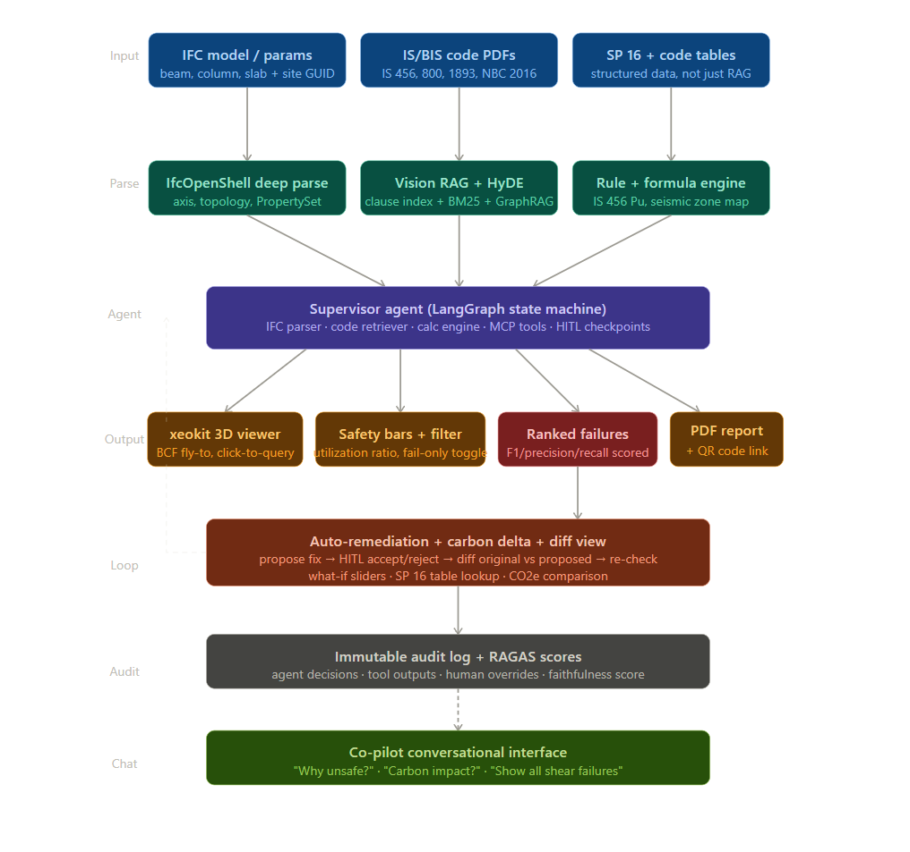
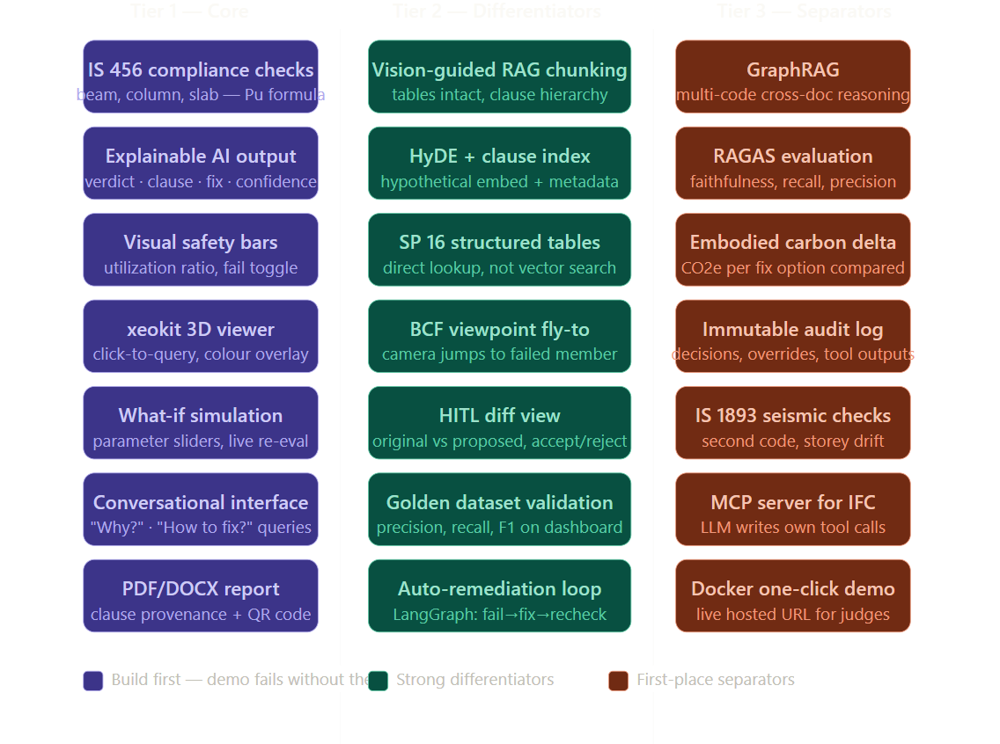

# StructurAI Co-Pilot: Agentic AI for Structural Design Review

An autonomous, Agentic AI Co-Pilot designed to automate structural engineering design reviews. By parsing Industry Foundation Classes (IFC) models against Indian Standard codes (IS 456, IS 1893, IS 800), the system compresses a typical 2-day manual review cycle into just 4 minutes. 

It provides structural engineers with explainable AI outputs, interactive 3D visualizations, and an automated remediation loop for non-compliant members.

---

## 🏗️ System Architecture

StructurAI Co-Pilot utilizes a highly modular, multi-agent architecture orchestrated by LangGraph. It seamlessly integrates deep IFC parsing, Vision-guided RAG, and an immutable audit trail.

### The Agentic Pipeline
1. **Input Layer:** Ingests IFC building models alongside structured SP 16 tables and IS/BIS Code PDFs (IS 456, 800, 1893, NBC 2016).
2. **Parsing & Retrieval:** - `IfcOpenShell` performs deep parsing to extract axis, topology, and PropertySets.
   - **Vision RAG + HyDE** handles complex code clause retrieval using BM25 and GraphRAG for cross-document reasoning.
3. **Agentic Core:** A Supervisor Agent (LangGraph State Machine) acts as the central brain, coordinating the IFC parser, code retriever, mathematical calculation engine, and MCP tools.
4. **Output & Visualization:** Renders the model using `xeokit` 3D viewer with BCF fly-to capabilities, color-coded safety bars, and ranked failures.
5. **Auto-Remediation Loop:** Proposes fixes, calculates the embodied carbon delta, and provides a Human-In-The-Loop (HITL) diff view before re-evaluating the model.
6. **Audit & Chat:** All decisions are logged in an immutable audit trail scored by RAGAS, accessible via a conversational Co-Pilot interface.

---

## 🌟 Feature Capabilities & Roadmap

The platform's capabilities are divided into three distinct tiers, ranging from core compliance to advanced AI differentiators.

### Tier 1: Core Functionality
* **IS 456 Compliance Checks:** Automated evaluation of beams, columns, and slabs (Pu formulas).
* **xeokit 3D Viewer:** Interactive click-to-query interface with live color overlays for failed members.
* **Explainable AI Output:** Transparent verdicts detailing exact clauses, proposed fixes, and confidence scores.
* **Conversational Interface:** "Why did this fail?" and "How can I fix it?" NLP querying.
* **PDF/DOCX Reports:** Professionally formatted exports with clause provenance and QR code links.

### Tier 2: Differentiators
* **Vision-Guided RAG Chunking:** Preserves complex tabular data and hierarchical clause structures.
* **HyDE + Clause Index:** Hypothetical document embeddings paired with rich metadata for zero-hallucination retrieval.
* **Auto-Remediation Loop:** LangGraph powered state machine that detects a failure, proposes a fix, and re-checks the simulation automatically.
* **HITL Diff View:** Side-by-side comparison of original vs. proposed designs with accept/reject toggles.
* **Golden Dataset Validation:** Real-time dashboard tracking precision, recall, and F1 metrics.

### Tier 3: Production Separators
* **GraphRAG Reasoning:** Advanced cross-document logic to resolve conflicts between multiple codes (e.g., IS 456 vs IS 1893).
* **Model Context Protocol (MCP) Server:** Allows the LLM to autonomously write and execute its own tool calls against the IFC data.
* **Embodied Carbon Delta:** Calculates the CO2e impact of proposed structural fixes.
* **Docker One-Click Demo:** Fully containerized deployment for seamless, live-hosted presentation to judges.

---

## 🧪 Evaluation Metrics

Our pipeline is rigorously tested against a golden dataset of structural designs , utilizing the **RAGAS framework** to ensure safety-critical accuracy:
* **F1 Score**
* **Faithfulness (RAGAS)**

---

## 📚 Research and References

Grounded in Peer-Reviewed Research & Industry Standards.

### Engineering Standards

* **IS 456:2000:** Plain and Reinforced Concrete compliance code implemented.
* **IS 1893:2016 (Part 1):** Criteria for Earthquake Resistant Design. Used for seismic zone mapping and storey drift checks.
* **IS 800:2007:** General Construction in Steel - Code of Practice. Used for steel member checks.
* **SP 16:1980:** Design Aids for Reinforced Concrete to IS 456. Pre-loaded as structured tables for Design Assistant.
* **NBC 2016:** National Building Code of India. Occupancy and fire resistance checks.

### AI & Technical Research

1. **IfcOpenShell Python API (`https://ifcopenshell.org/docs/`):** IFC parsing, topology traversal, PropertySet extraction.
2. **LangChain RAG Docs (`https://python.langchain.com/docs/use_cases/question_answering/`):** RAG pipeline, EnsembleRetriever, HyDE implementation.
3. **RAGAS Framework:** Shahul et al. (2023) RAG evaluation: faithfulness, context recall, precision, answer relevancy.
4. **xeokit BIM Viewer SDK (`https://xeokit.io`):** Open-source BIM viewer, BCFViewpoints Plugin, StoreyViews Plugin.
5. **IS 456:2000:** Plain and Reinforced Concrete Code, BIS: https://www.bis.gov.in
6. **AI in AEC Compliance:** Frontiers in Built Environment (2025), MDPI Metals (2025), Nature Scientific Reports (2023).
7. **Anthropic Claude API:** https://docs.anthropic.com

---
